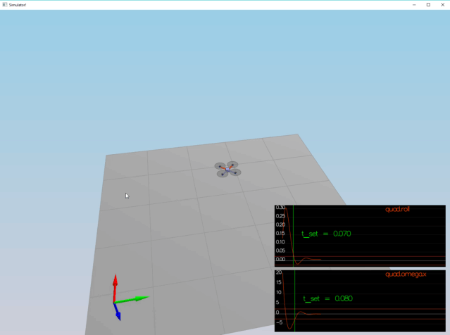
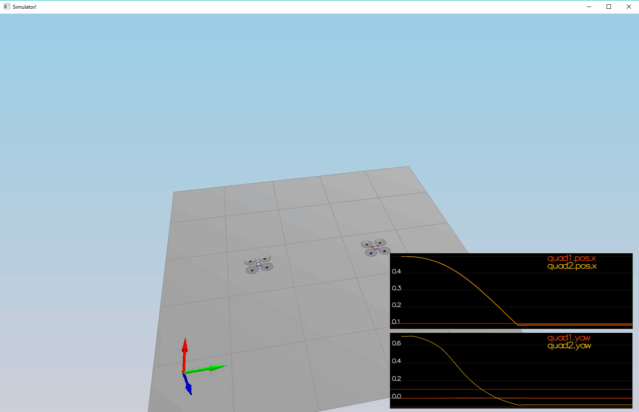
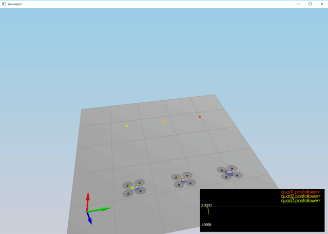
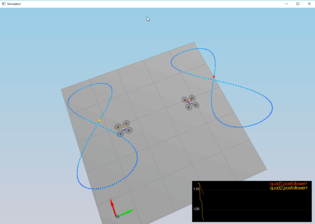
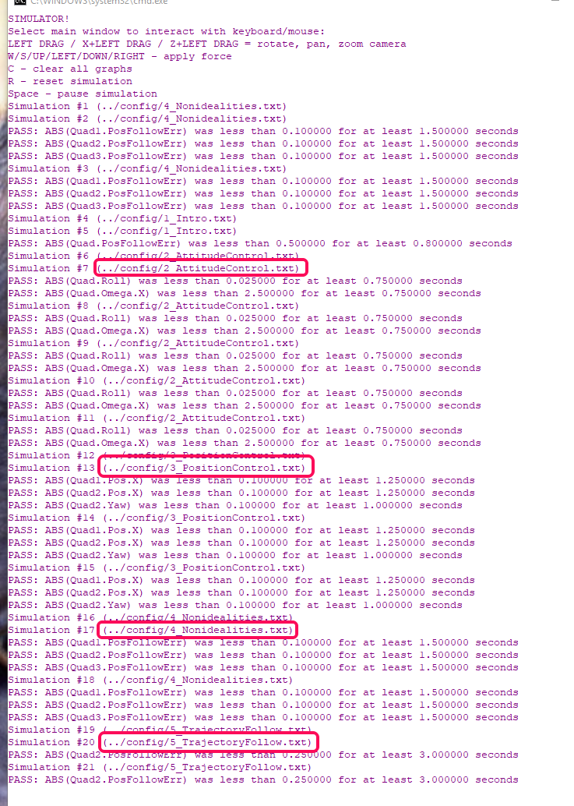

# The Controller Project

The quadroter for the project has the following configuration:

## Command and Control

### Run Command

Based on the above configuration, we have the following system of equations for computing individual thrusts from the total thrust and angular momentums:

Where:

We solve the system for individual forces and get our run command code:

### Body Rate Controller

Three moment commands are based on the formula:

for each axis.

We tune the `kpPQR` parameter

### Roll Pitch Controller

where:

, is the tilt angle command.

We need to constrain this by the `(-maxTiltAngle, maxTiltAngle)` range. `CONSTRAIN` macro is handy for these operations. The rotation matrix is already given, so this is easy to implement

### Position Controls (Lateral and Altitude)

Both the altitude and the lateral position controllers are PD controllers, we can write them in a "cascaded" form where [Sergei Lupashin's paper](https://www.overleaf.com/read/bgrkghpggnyc#/61023787/) on the ratio of velocity vs position gains applies:

Both altitude and lateral controllers are based on the same formula (with the appropriate _x_, _y_, _z_ substituted). Altitude controller has an additional integration component (which makes it a PID controller).

In all cases, the velocity command portion needs to be limited. This portion is given by:

Tuning of all positional and velocity parameters is done based on the paper above (keeping a ratio of about 3 - 4 between velocities and positions gains)

#### Lateral Position Controller

We constrain the velocity and acceleration command portions of this controller by magnitude, using `magXY()` function of `V3F` class.

#### Altitude Controller

where

, the positional error term.

Different mass copters are able to run with the addition of the integral term
### Yaw Controller

we tune `kpYaw`.

## Scenarios

All scenarios are passing with the `QuadControlParams.txt` currently checked in.

## Scenario 2

## Scenario 3

## Scenario 4

## Scenario 5

## Tests

