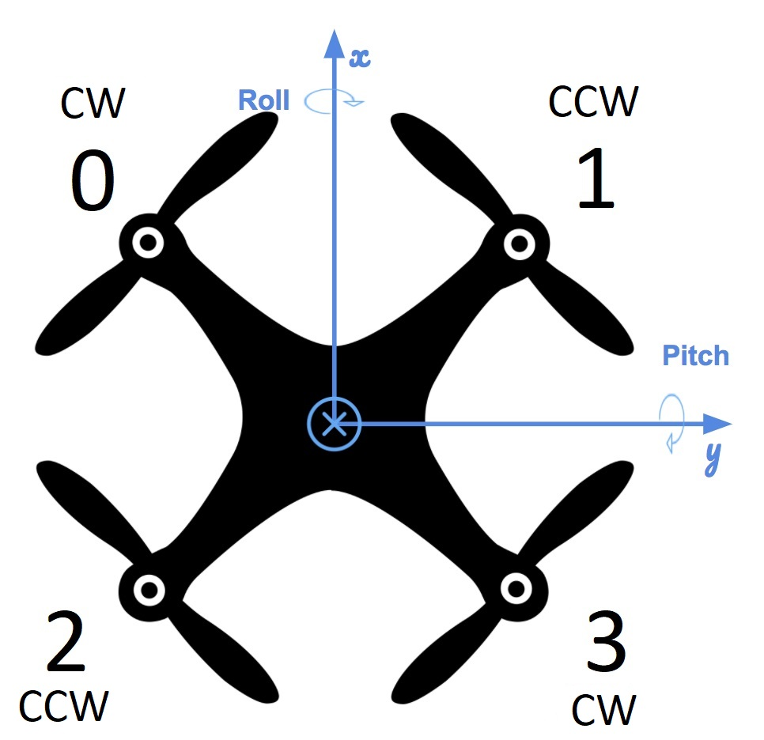

# The Controller Project

The quadroter for the project has the following configuration:

## Run Command

Based on the above configuration, we have the following system of equations for computing individual thrusts from the total thrust and angular momentums:

Where:

We solve the system for the individual forces and get our run command code.

