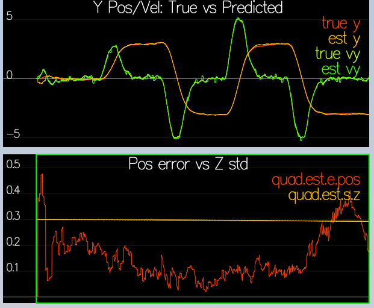

# The Estimation Project

## Step 1: Standard Deviation of Sensor Measurements

Collected sensor data and created a small python script that computes STDs for both cases:

```python
import pandas as pd

collected_data = r"C:\Git\udacity\fcnd\estimation\config\log\Graph2.txt"
df = pd.read_csv(collected_data)
df.iloc[:, 1].std()
```


STDs computed this way match the ones in `SimpleSensors.txt` very closely.

## Step 2: Better Gyro Attitude Integration

Used the already provided integration scheme utilizing quaternions. This is also a method recommended in the [Estimation for Quadrotors](https://www.overleaf.com/read/vymfngphcccj#/54894644/) paper.


## Step 3: Predict

This is by far the most complex step in this project:

* Followed the [paper](https://www.overleaf.com/read/vymfngphcccj#/54894644/) to implement transition function <a href="https://www.codecogs.com/eqnedit.php?latex=g(x_t,&space;u_t,&space;\Delta&space;t)" target="_blank"></a>.
This was easy, no need to code the rotation matrix since the library already provides a way to rotate acceleration from body to global frame.
* Implemented the <a href="https://www.codecogs.com/eqnedit.php?latex=R'_{bg}" target="_blank"></a> as `GetRgbPrime`function.
* Computed Jacobian <a href="https://www.codecogs.com/eqnedit.php?latex=g'(x_t,&space;u_t,&space;\Delta&space;t)" target="_blank"></a> of <a href="https://www.codecogs.com/eqnedit.php?latex=g(x_t,&space;u_t,&space;\Delta&space;t)" target="_blank"></a>
* To update the covariance matrix, used the EKF pseudocode from the [paper](https://www.overleaf.com/read/vymfngphcccj#/54894644/).

As the result, we obtain the following estimates for Y and Z positions and velocities:


And our covariances yield the following corridors for estimated velocities:


## Step 4: Magnetometer update

This is an easy update. The only "gotcha" provided as a hint in the code is to add/subtract `2*PI` to/from the measurement when the difference between predicted and measured yaw is greater than `abs(PI)`


## Step 5: Closed Loop + GPS Update

This is another easy update, based on section 7.3.1 of the [paper](https://www.overleaf.com/read/vymfngphcccj#/54894644/)

I regard this step and the one that follows as one step, since here we get to actually "close the loop" on the last two topics of Term 1.



## Step 6: Bringing it All Together

The video is posted on [YouTube](http://www.youtube.com/watch?v=iN-5Ts82Kvg). De-tuned in 2 steps:

* with "ideal" sensors (un-comment sensor std lines for Scenario 11)
* with "real" sensors (comment sensor std lines for Scenario 11)

Hint in the [README](README.md) to decrease gains by about 30% was a great help.

[](http://www.youtube.com/watch?v=iN-5Ts82Kvg)

It was an awesome, fun flight!