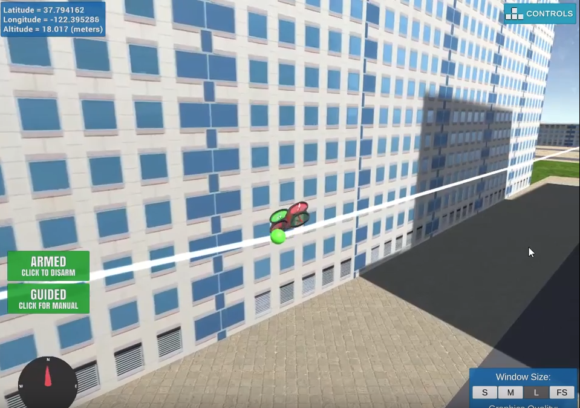
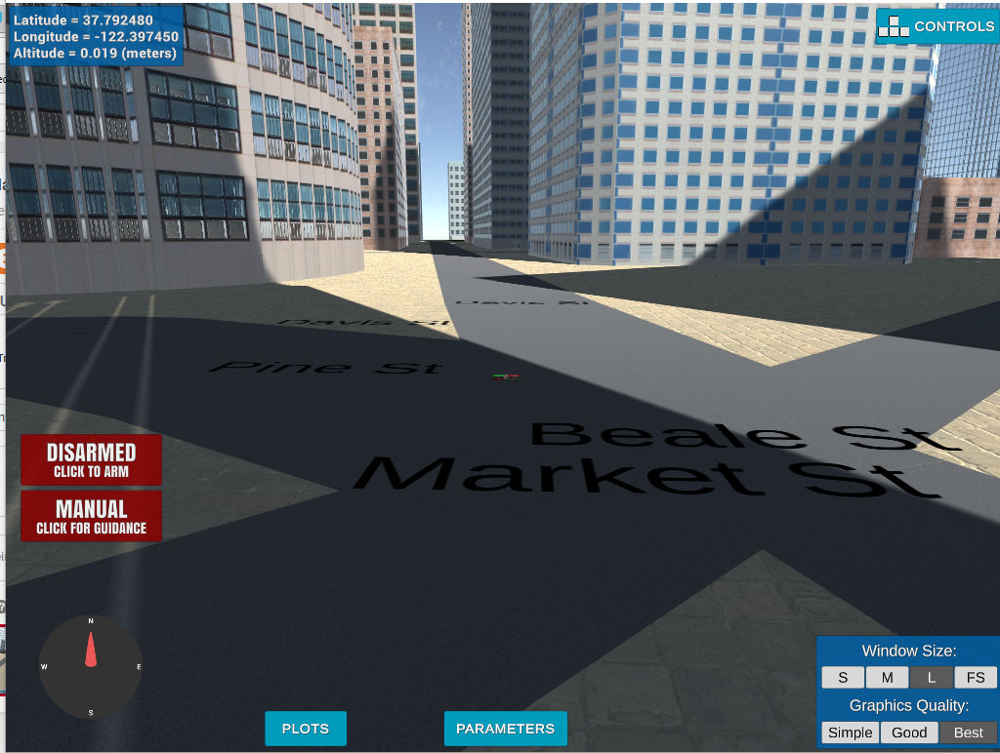
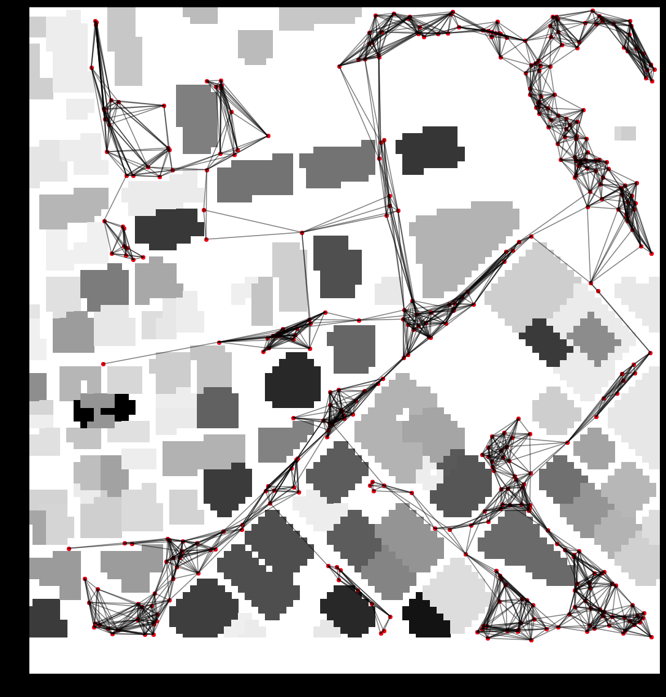
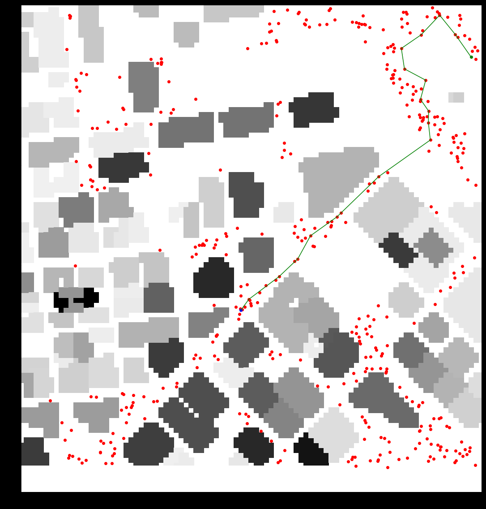

## Project: 3D Motion Planning




# Required Steps for a Passing Submission:

1. Load the 2.5D map in the colliders.csv file describing the environment.
2. Discretize the environment into a grid or graph representation.
3. Define the start and goal locations.
4. Perform a search using A* or other search algorithm.
5. Use a collinearity test or ray tracing method (like Bresenham) to remove unnecessary waypoints.
6. Return waypoints in local ECEF coordinates (format for `self.all_waypoints` is [N, E, altitude, heading], where the drone’s start location corresponds to [0, 0, 0, 0].
7. Write it up.
8. Congratulations!  Your Done!

## [Rubric](https://review.udacity.com/#!/rubrics/1534/view) Points

### Introduction

Unlike some drones out there that prefer to fly cautiously looking around before they take the next step, afraid to soar, wasting computational cycles, this drone lives dangerously. It flies in a range of heights (from 10 to 25 m), on a pre-computed graph of points spanning (most of) the collision grid.

This approach should be complemented with a receding horizon algorithm (not implemented in this project) for flying on a non-static grid.

Advantages:

* The graph can be pre-computed
* Flying on the graph is less computationally intensive than flying on the grid as there are fewer points that span more space.
* No need for waypoint pruning: we are already flying on a sparce collection of points

#### `motion_planning.py` and `planning_utils.py`

`planning_utils.py` is a kitchen sink that contains all kinds of functions, useful and not so much. These are functions from lesson exercises, sometimes modified, sometimes left as is. There is also a useful `Sampler` class, that computes obstacle polygons and their heights. This is used for creating graphs and adding points to them (like start and goal), as well as computing nodes of the flight graph through stochastic sampling followed by elimination of points that coincide with obstacles.

The file also contains several `visualize_xxx` functions, used for visualizations in the notebooks.

`motion_planning.py` is the driver for the project.

```sh
python motion_planning.py
```
with running simulator to compute a path and watch it fly!

### Implementing Your Path Planning Algorithm

Here are the steps:

#### 0. Pre-compute the graph

Because the graph is similar to a map DVD used by GPS systems to compute routes, I feel it is perfectly justified to have it pre-computed. I compute the graph by stochastical sampling of the points and culling the ones that fall into an obstacle. The graph is computed and saved the very first time we run motion planning.

**Note:** Since the simulator may abort the connection before the graph is actually computed, I have created the graph in the [Receding Horizon Notebook](https://github.com/fierval/fcnd/blob/master/motion_planning/Receding-Horizon.ipynb)

#### 1. Set your global home position

All data is read upon instantiation of the `MotionPlanning` object. Home position is set at the top of `plan_path`



#### 2. Set your current local position

In `plan_path` we retrieve our local position by calling `global_to_local` (defined in `planning_utils.py`)
The coordinates we receive this way are then fed to our `pick_a_start` function, which simply adds the starting position (in this case - the center of the grid) to the graph.

**Note:** Since all the points on the graph are computed relative to the center, there is no need to offset any of the waypoints! Another advantage of adding a bit of chaos (or stochasticity) to our ordered life.

#### 3. Set grid start position from local position

Add the starting point to the graph by calling `pick_a_start`

#### 4. Set grid goal position from geodetic coords

In this implementation, we are striving for as "spectacular" a path as possible. This drone is seriously into aesthetics of flight, so we implement a heuristic to search for the goal (lines 226 - 231 in `motion_planning.py`):

```python
path = []
tries = 0
while(len(path) < 13 and tries < 30):
    graph_goal = self.pick_a_goal()
    path, _ = a_star_graph(self.graph, heuristic, graph_start, graph_goal)
    tries += 1
```
The key here is `pick_a_goal` - the function that chooses a number of random goals for us and if the first goal picked from that selection can be added to the graph (it's not an obstacle of any kind), selects it. (The process is repeated for all random picked goals until one that can be added to the graph is found).

Since we want a path of a certain length, we may have to run a few tries before we pick the satisfying goal. All the goals we rejected due to too short a path will stay added to the graph. They are all valid points and there will not be too many of them.

**Note:** In order to satisfy the requirement of setting the goal from geodetic coordinates, `pick_a_goal_global` function is provided

#### 5. Modify A* to include diagonal motion (or replace A* altogether)

Graph creation was modified to include the actual cost of travel along the edge as the Euclidean distance between its nodes.

`extract_polygons` was modified to "pad" polygons with a safe travel distance.

`a_star_graph` was used to compute the path in 3D.

#### 6. Cull waypoints

Since all the points in the graph are in 3D and selected at random, colinearity is not going to be useful at all. Brezenham could be useful, but tough to compute. In this exercise, I am trying to find a path with **more** rather than **less** points because by construction large areas of the grid are accessible through few waypoints.

The optimization that comes to mind would be to create a less connected graph:


Here the number of connected neighbors is 12 - a bit high, but I could not make all the components connect otherwise! Something to think about.

### Execute the flight

Here is a computed path. It consists of 18 waypoints - unusual stroke of luck, it is hard to get paths longer than 11 points on this graph:



### See it fly!

Click below for the YouTube video of flight along the above path. The [Motion Planning Notebook](https://github.com/fierval/fcnd/blob/master/motion_planning/Motion%20Planning.ipynb) is the source of all the images in this doc.

[](https://youtu.be/JccKcmcnVCU)

### Double check that you've met specifications for each of the [rubric](https://review.udacity.com/#!/rubrics/1534/view) points.

# Extra Challenges: Real World Planning

For an extra challenge, consider implementing some of the techniques described in the "Real World Planning" lesson. You could try implementing a vehicle model to take dynamic constraints into account, or implement a replanning method to invoke if you get off course or encounter unexpected obstacles.
